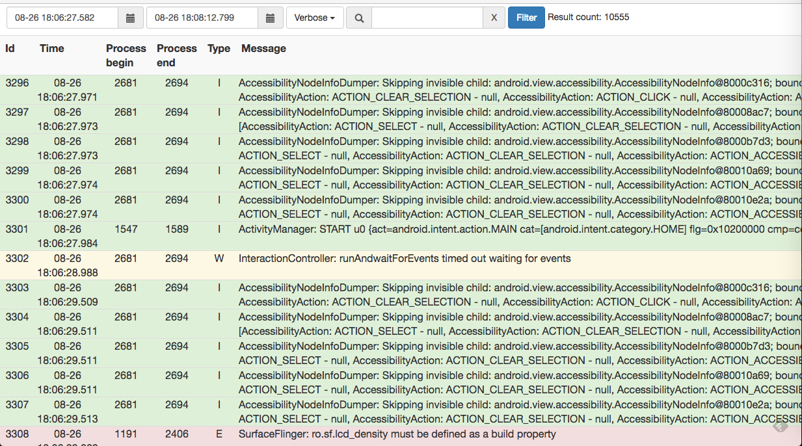

# Logcat Viewer

---

</img>

# Usage:

```
logcatViewer.html?file=logcat.txt&type=Error&startTime=08-27 18:53:01.789&endTime=08-27 18:54:01.456
```

# Params:

 * file: Path of logcat recording file
 * type: Default type of record for filter, can be changed with Verbose/Debug /Info/Warn/Error/Assert
 * startTime: Default start time of record for filter, format with {MM-dd HH:mm:ss.SSS} 
 * endTime: Default end time of record for filter, format with {MM-dd HH:mm:ss.SSS}
